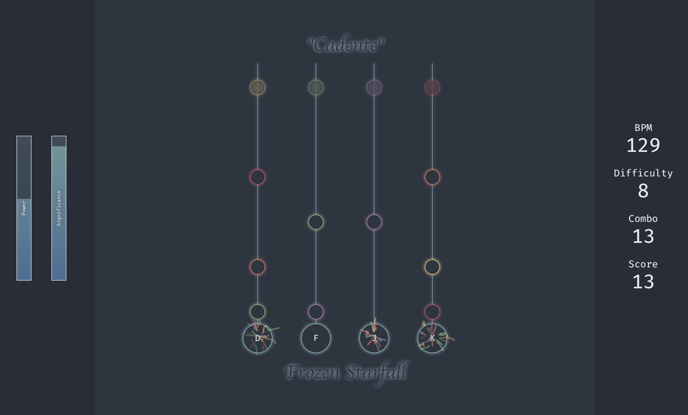

*This is a project for Prof. Purtee's CSC 171.*

# Documentation for Yuri

This project is a four-key rhythm game under the working title *Yuri*. It is not complete, but it is presentable!



## User manual

To play a rhythm game is to click notes. In *Yuri*, notes fall along four lines and you must click the corresponding key (D, F, J, or K) when the note reaches the circle.

Doing so will earn you a point and create a multicoloured sparkle (blue sparkles are purely decorative and can be summoned by clicking anywhere). Reported to you are statistical power and significance, your score, and combo (the number of notes hit in a row).

By default, the game will use the song "Cadente" by Frozen Starfall, which has a note pattern specified in "cadente.yrct".

## Technical specification and design philosophy

The main file for this project is "Yuri.java", and it can be run by calling javac and java with the JavaFX library and its controls and media modules.

The fundamental unit is a Manager, which might draw things, have children, and tell its children what to do as driven by the pressures of society (if society referred to the AnimationTimer in "Yuri.java"). The children are very rebellious and use the system clock instead of the time given to them by the AnimationTimer as to ensure the notes sync up with the music.

An illustrative example:

```java
/**
    A {@code ChartManager} is the high-level interface for managing charts. Calling `distribute_timestep` will have it tell its children to poll the messenger and figure out what they're supposed to look like.

    A {@code Chart} is a graphic used for displaying either statistical power (the chance that if there was a note, you hit it) or significance (the chance that if you hit, you hit a note and not thin air). It consists of a background, partial cover, outline, and label.
 */
public class ChartManager extends VBox {
    ...
```

Please see the source files for the individual classes.

Miscellaneous files include "Nord.java" to declare the color scheme, "chartgen.py" to create .yrct files by Markov chain and functional programming (please see it! it's my favorite file!), and "Mini.java" to hold various small accessory classes lest I end up with 30 source files.

## AI tool use

I used AI tools to speed up the reading of online sources by asking questions I didn't want to consult documentation for. No Java code from these conversations was used except for see below.

I used AI tools on the following tasks in this project:

- To write code. I often had AI write my getters and setters. No other code was written by AI.
- To format. An existing code style was applied to other existing code.
- To learn style. e.g., "when is a nested class better?"
